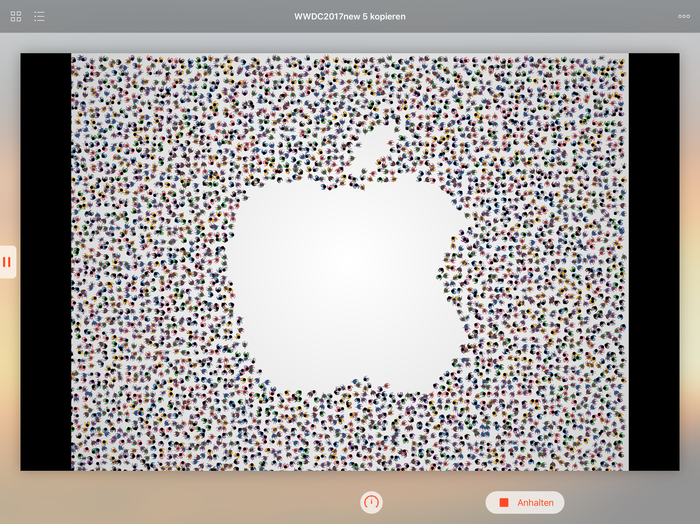

# WWDC17-Scholarship-submission

My submission for the WWDC17 Scholarship program. I got accepted! :]

My Playground is a dynamic trailer for WWDC, inspired by the WWDC 2017 wallpapers. The trailer consists of different forms, which will be built by small characters. They spawn at a random location offscreen and walk to their final position in the form. I used SpriteKit to manage and animate the characters. 
Some forms are included in the Playground, however custom forms can be added, too. A form is represented by one or more Beziercurves and can be added to a choreography as UIBezierPath. 

A scene only is convincing when sound is added to it. So I added footsteps while the characters are walking with AVAudioEngine. When one character is walking in the scene exactly one pair of footsteps can be heard. The more characters are walking, the more footsteps can be heard. To mimic the footsteps of a great mass of people, where different people walk at different speeds and with different shoes, the pitch and speed of the individual steps are choosen at random. The background music was composed in Garageband on my iPad. 
Every single choreographic element can be equipped with different options: e.g. if characters, who are present in the scene at the moment should be reused, the duration for forming this specific form or the starting and stopping of the background music. Besides that there is also an option called spawn variance, which is the maximum random position offset when placing characters. When this is set to zero, the characters positions form a grid. Setting this to a value of e.g. 4 still maintains the outlines of the given form, but also creates a kind of messiness in the form, which looks far more convincing.
By default the characters use the same colors like the ones in the WWDC wallpapers. To make the trailer as customizable as possible these can be changed to every possible color. To achieve that I wrote an extension for CGImage, which returns a new image with replaced colors. This way every character gets one of the entered color combinations at random.

In my Playground you will find examples for the customizations described above. Have fun playing around in my Playground!

